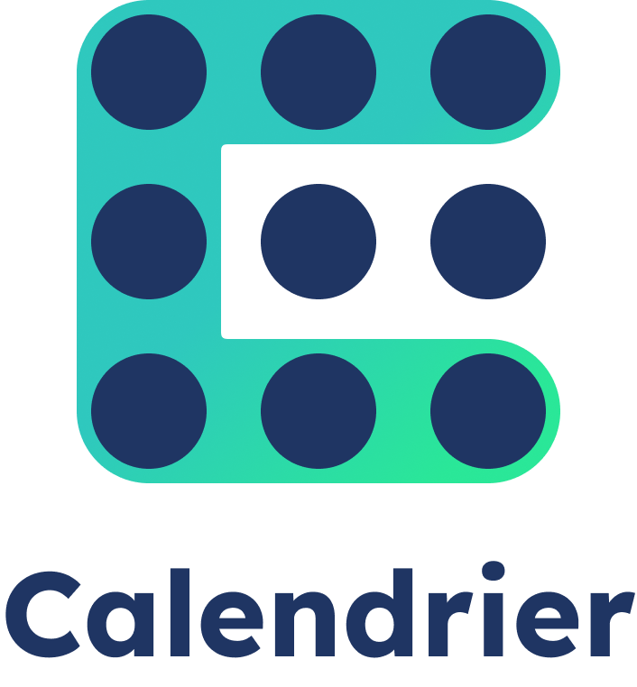

# Mon super calendrier


**Contexte** :
Vous venez d'être embauché au sein d'une petite société de service bordelaise. Malgré un bon fonctionnement général et
suite aux différentes crises sanitaires, votre entreprise peine à trouver une organisation de planning satisfaisante.
Elle décide donc de vous mettre sur le coup guidé par un lead-developper afin de construire un portail interne de gestion
de calendrier. Cette application aura pour but de gérer les jours de télétravail et de congés de toute l'entreprise.

**Consignes de depart** : Ce document fait office de cahier des charges et sera une référence tout au long du projet.
Vous trouverez ci-dessous une liste exhaustive des models et des routes à implémenter. L'organisation du code source est
libre, **CEPENDANT** l'organisation de code recommandée par NestJS est FORTEMENT recommandée. Votre notation sera basée
sur le nombre de tests qui passent avec succès et sera ponderée par votre style de code (propreté, intelligence de code,
conventions de nommage, ...). Tout au long de ce document, vous trouverez des notes apportées par votre supérieur,
lead-developper qui vous donnera le format de retour ou des types d'erreurs à retourner.
**Tout plagiat sera fortement sanctionné par une note de 0 à la fin du module.**

Vous trouverez toutes les informations nécessaires à l'installation du projet et au lancement des tests dans le fichier `README.md`.

## Models

Vous trouverez ci-dessous une liste exhaustive des differents models à implémenter pour réaliser ce projet. Chaque model
sera décrit par ses propriétés, et, chacune d'elles seront définies par leurs types et par un `!` ou un `?` selon si
elles sont respectivement requises ou optionnelles pour traiter l'entité. De plus dans le cas où la propriété est
optionnelle, lorsqu'une valeur par defaut sera à attribuer cette valeur sera expressement précisée.

**Note** : Ces models seront donnés sous forme de classe avec le strict minimum d'informations. Il ne faudra **PAS** simplement
copier-coller ces blocs de code pour que cela fonctionne.

### user.entity.ts

```ts
class User {
     public id!: string; //au format uuidv4
     public username!: string; // cette propriété doit porter une contrainte d'unicité
     public email!: string; // cette propriété doit porter une contrainte d'unicité
     public password!: string;
     public role!: 'Employee' | 'Admin' | 'ProjectManager' // valeur par defaut : 'Employee'
}
```

### project.entity.ts
```ts
class Project {
     public id!: string; //au format uuidv4
     public name!: string;
     public referringEmployeeId!: string; //au format uuidv4
}
```

### project-user.entity.ts
```ts
class ProjectUser {
     public id!: string; //au format uuidv4
     public startDate!: Date;
     public endDate!: Date;
     public projectId!: string; //au format uuidv4
     public userId!: string; //au format uuidv4
}
```

### event.entity.ts
```ts
class Event {
     public id!: string; //au format uuidv4
     public date!: Date;
     public eventStatus?: 'Pending' | 'Accepted' | 'Declined' // valeur par défaut : 'Pending';
     public eventType!: 'RemoteWork' | 'PaidLeave';
     public eventDescription?: string;
     public userId!: string; //au format uuidv4
}
```

## Routes

Vous trouverez ci-dessous une liste exhaustive des différentes routes à intégrer organisées par model cible pour réaliser
ce projet. A chaque route sera associé une description métier de la route fournie par votre employeur ainsi que, si
nécessaire, une note du lead-developper qui travaille avec vous sur ce projet.
Attention à bien respecter scrupuleusement le chemin donne par vos routes, sans quoi, vos tests ne pourront s'effectuer
convenablement. Si nécessaire, à la suite du speech client et des potentielles notes du lead-developper, vous trouverez
les paramètres de la route si celle-ci en a besoin.

*Sauf indication contraire toutes les routes devront être protegées. (Devra renvoyer une 401 (Unauthorized) si l'utilisateur n'est pas connecté).*

### users.controller.ts

#### 🟩 POST users/auth/sign-up (route publique)

Speech client : En tant qu'employé, je veux pouvoir m'inscrire sur le portail afin de pouvoir gérer mon planning ainsi que celui de mon équipe.

*Notes du lead-developper: Pour cette route, tu dois prendre en compte le username, le password et l'email de l'utilisateur.
Afin de garantir la validation des données, tu vas devoir mettre en place une validation des paramètres. Il faudrait un
mot de passe d'au moins 8 caractères, un email bien formatté et un username d'au moins 3 caractères. Attention à bien
gérer l'attribution des roles, ce dernier est facultatif dans la route. Penses à ne **jamais renvoyer le mot de passe** des
utilisateurs, sur aucune route, sinon le patron ne va vraiment pas être content... Mais surtout n'oublie pas de hasher
le mot de passe*

```
Parametres (body) :

username!: string;
password!: string;
email!: string;
role?: 'Employee' | 'Admin' | 'ProjectManager';
```

#### 🟩 POST users/auth/login (route publique)

Speech client : En tant qu'employé, je veux pouvoir me connecter sur le portail afin de pouvoir accéder à toutes les
fonctionnalités qui necessitent une authentification.

*Notes du lead-developper: Tu dois gérer une authentification par email / mot de passe. Ah et penses bien à renvoyer le
JWT dans un objet contenant la clé `access_token` pour que le développeur front-end puisse le stocker de son côté et te
le renvoyer dans chaque requête qui auront besoin d'une authentification pour fonctionner.*

```
Parametres (body) :

email!: string;
password!: string;
```

#### 🟩  GET users/:id

Speech client : En tant qu'employé, je veux pouvoir voir les informations personnelles d'un utilisateur de la plateforme en particulier.

```
Parametres (query) :

id!: string; //au format uuidv4
```

#### 🟩 GET users/

Speech client : En tant qu'employé, je veux pouvoir voir la liste de tous les utilisateurs actuellement inscrits sur la plateforme

#### 🟩 GET users/me

Speech client : En tant qu'employé, je dois pouvoir afficher, sur la plateforme, mes informations personnelles afin de me rappeler que je suis connecté.

*Notes du lead-developper : Tu peux utiliser le token d'authentification de la requête pour identifier la personne actuellement connectée.*

#### GET /users/:id/meal-vouchers/:month

Speech client : En tant qu'employé, je dois pouvoir voir le montant accordé en titres restaurant par l'entreprise pour 
un mois donné afin d'éviter des erreurs comptables dans le calculs des titres restaurants.

Critères d'acceptation : **Étant donné** que je suis un employé et que je travaille du Lundi au Vendredi sans interruption, et ce, même les jours féries,
**lorsque** je demande mon montant de titres restaurant pour un mois donné **alors** le système me donne ce montant selon
le calcul suivant : l'entreprise accorde 8 euros de titres restaurants par jour travaillé par employé et les employés
n'ont pas le droit aux titres restaurants les jours de télétravail ou de congés payés

```
Parametres (query) :

id!: string; //au format uuidv4
month!: number; //nombres de 1 (Janvier) à 12 (Decembre)
```

### 🟦projects.controller.ts

#### 🟦GET /projects

Speech client :
- En tant qu'*Administrateurs* ou *Chef de projet*, je veux pouvoir voir la liste de tous les projets de l'entreprise.
- En tant qu'*Employé*, je veux pouvoir voir uniquement la liste de tous les projets de l'entreprise dans lesquels je suis impliqué.

#### 🟦GET /projects/:id

Speech client :
- En tant qu'*Administrateurs* ou *Chef de projet*, je veux pouvoir consulter un projet en particulier.
- En tant qu'*Employé*, je veux pouvoir voir un projet de l'entreprise dans lequel je suis impliqué.

*Notes du lead-developper : Dans le cas où un utilisateur n'a pas le droit de consulter le projet demandé, il faudrait
que tu me renvoies une **ForbiddenError***.

```
Parametres (query) :

id!: string; //au format uuidv4
```

#### 🟦POST /projects

Speech client : En tant qu'*Administrateur*, je veux pouvoir créer un projet en renseignant un nom, une description et un
référent qui doit être *Administrateur* ou *Chef de projet*.

*Notes du lead-developper : Si une personne essaie de créer un projet sans être administrateur, il faut que tu me renvoies
une **UnauthorizedException**. Fais en de même si la personne référente donnée n'est pas au minimum un chef de projet.
Penses à mettre en place une validation sur ta route, il faut que le nom du projet contienne au moins 3 caractères. Pour
que le portail puisse afficher une modale de succès, il faudrait que tu m'inclues la relation **referringEmployee** dans
le retour de la route.*

```
Parametres (body) :

name!: string;
referringEmployeeId!: string; //au format uuidv4
```

### 🟦project-users.controller.ts

#### 🟦GET /project-users

Speech client :
- En tant qu'*Administrateurs* ou *Chef de projet*, je veux pouvoir voir toutes les assignations des employés aux différents projets.
- En tant qu'*Employé*, je veux pouvoir voir toutes mes assignations aux différents projets.


#### 🟦GET /project-users/:id

Speech client :
- En tant qu'*Administrateurs* ou *Chef de projet*, je veux pouvoir voir une assignation en particulier.
- En tant qu'*Employé*, je veux pouvoir voir une de mes assignations.

*Notes du lead-developper : Dans le cas où tu n'as pas accès à la ressource demandée, penses bien à renvoyer une UnauthorizedException.*

```
Parametres (query) :

id!: string; //au format uuidv4
```

#### 🟦POST /project-users

Speech client : En tant qu'*Administrateurs* ou *Chef de projet*, je dois pouvoir assigner un employé à un projet pour
une durée determinée si ce dernier n'est pas déja affecté à un autre projet en même temps.

*Notes du lead-developper : Dans le cas où l'employé est déjà affecté à un projet pour la période demandée, tu dois me
renvoyer une ConflictException. Tout comme dans les autres routes, si un utilisateur n'a pas les droits pour effectuer
cette action, il faut que tu me renvoies une UnauthorizedException. Pour que le portail puisse afficher une modale de
succès, il faudrait que tu m'inclues les relations **user**, **project** et **referringEmployee** de project dans le retour de la route.*

```
Parametres (body) :

startDate!: Date;
endDate!: Date;
userId!: string; //au format uuidv4
projectId!: string; //au format uuidv4
```

### 🟥events.controller.ts

#### 🟥GET /events

Speech client : En tant qu'utilisateur connecté, je veux pouvoir voir tous les évènements planifiés de tous les utilisateurs.

#### 🟥GET /events/:id

Speech client : En tant qu'utilisateur connecté, je veux pouvoir voir les informations d'un évènement en particulier.

*Notes du lead-developper : Penses bien à me renvoyer l'erreur appropriée dans le cas ou l'évènement demandé n'est pas trouvé.*

```
Parametres (query) :

id!: string; //au format uuidv4
```

#### 🟥POST /events

Speech client : Je veux que mes utilisateurs puissent poser un évènement de type *Télétravail* ou *Congé payé*.
Voici la règlementation actuellement en place au sein de l'entreprise :
- Il est impossible de se mettre en télétravail plus de deux jours par semaine
- Il est impossible d'avoir deux évènements quel que soit le statut de ce dernier sur la meme journée
- Les télétravails ne sont pas soumis à validation d'un supérieur
- Si un *Employé* essaie de créer un évènement de congé, ce dernier est en statut *En attente* et sera soumis à validation d'un supérieur

*Notes du lead-developper : il est impossible de créer un évènement pour quelqu'un d'autre, tu peux déduire le userId via la requête.*

```
Parametres (body) :

date!: Date;
eventDescription?: string;
eventType!: 'RemoteWork' | 'PaidLeave';
```

#### 🟥POST /events/:id/validate
#### 🟥POST /events/:id/decline

Speech client : La validation de congés payes se fait sous certaines conditions :
- Il est impossible d'altérer le statut d'un projet déjà validé ou refusé
- Les administrateurs peuvent valider n'importe quelle demande
- Il n'est possible de traiter un évènement que si l'utilisateur est rattaché à un projet le jour de l'évènement
- Les chefs de projet peuvent valider ou refuser un évènement que si l'utilisateur est rattaché à un projet où le chef est référent pour la date de l'évènement.
```
Parametres (query) :

id!: string; //au format uuidv4
```

### 🟥BONUS

- Afin d'être conforme aux consignes delivrés par la CNIL, vous devez tracer toutes les requêtes effectuées sur votre API. Pour ce faire, vous *intercepterez* chaque requête effectuée et écrirez dans un fichier logs.txt une ligne par requête. Une ligne devra contenir : l'ip de la machine ayant fait la requête, la route appelée, les paramètres si ils existent ainsi que la date et l'heure de la requête.

- Afin de faciliter la communication des jours planifiés aux RH, il doit être possible d'exporter un csv contenant la liste de tout les congés acceptés du mois en cours. Une ligne correspondra à un évènement. Sur cette ligne devra également apparaitre le nom et prénom de l'utilisateur ayant pris son congé et le projet auquel ce dernier était rattaché le jour de son congé.

- Afin d'éviter au maximum toute intervention humaine, le csv ci-dessus devra être géneré automatiquement le 25 de chaque mois et sera stocké dans un fichier à la racine du projet.

## Organisation des tests

### day1.testing.ts
- POST /users/auth/sign-up
- POST /users/auth/login
- GET /users/me

### day2-part1.testing.ts
- GET /users/
- GET /users/:id

### day2-part2.testing.ts
- POST /project-users/ (**Obligatoire** pour les tests du jour mais pas testée directement)
- POST /projects/
- GET /projects/
- GET /projects/:id

### day3.testing.ts
- POST /project-users/
- GET /project-users/
- GET /project-users/:id

### day4.testing.ts
- POST /events/
- GET /events/
- GET /events/:id

### day5-part1.testing.ts
- POST /events/:id/validate
- POST /events/:id/decline

### day5-part2.testing.ts
- GET /users/:id/meal-vouchers/:month

## Notes techniques
- Le fichier main.ts ne doit **PAS** être modifié.
- Le projet se faisant avec une base de type postgres, vous devez utiliser TypeOrm afin de traiter vos données en base.
- Le paquet dayjs est fourni, n'hésitez pas à l'utiliser pour la gestion des dates.
- Il est fortement recommandé d'utiliser le [CLI de NestJS](https://docs.nestjs.com/cli/overview) pour générer vos fichiers de code source.
- Vous pourrez tester votre API via Postman. Cependant, un [swagger](http://localhost:3000/docs) vous est fourni pour vous faciliter les choses. 
